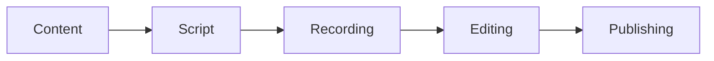

```modelica  linenums="5" title="Sample Code" hl_lines="2-4"
model FirstOrder
  parameter Real T = 1.0 "Time constant";
  Real x(start=0) "State variable";
equation
  T * der(x) + x = 1.0;
end FirstOrder;
```
## Component-based Modeling in Open-Modelica
<iframe 
  width="560" 
  height="315" 
  src="https://www.youtube.com/embed/B_ia0dflxCQ" 
  title="YouTube video player" 
  frameborder="0" 
  allow="accelerometer; autoplay; clipboard-write; encrypted-media; gyroscope; picture-in-picture" 
  allowfullscreen>
</iframe>




