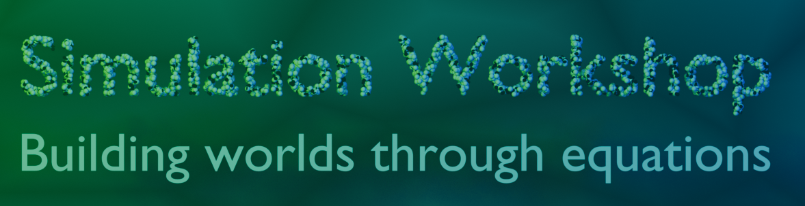

# Welcome to simulation workshop!

  

This website is part of my desire to teach and learn system modeling.

??? "Introduction to system modeling using Modelica"
    Model complex systems more efficiently.
    Modelica is an object oriented language to model cyber-physical systems. It supports acausal connection of reusable components governed by mathematical equations to facilitate modeling from first principles.

    [**Video and text-based tutorials about Modeling & Simulation using Modelica**](./Workshops/Modelica_Workshop.md)

??? "Numerical Simulations using Python"

    **Coming Soon**

??? "Scientific Computing using Julia"

    **Coming Soon**

??? "Understanding the physics behind simulations"
    
    **Coming Soon**
